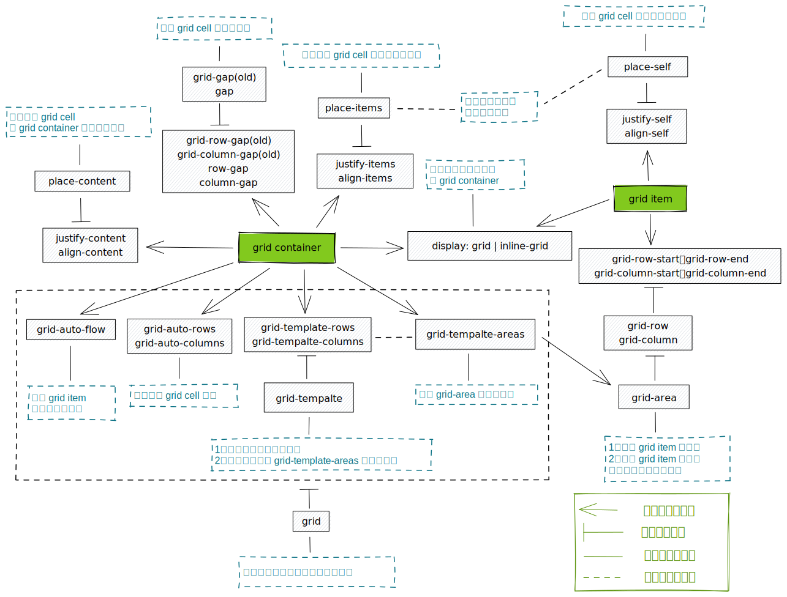

css grid，也可以简称为 grid 布局。是一种完全和以前所有其它的，都截然不同的 web 布局方式

对于界面布局，我们曾经都使用过`table`、`float`、`position`定位以及`inline-block`。这些属性用在布局上，其实本质上都是一种投机取巧的 hack。因此，它们本质上并不是用来做页面布局的，只是限制于当时能够使用的属性，不得已让它们来担负了此重任

提到 css grid，可能就会想到 [flex](https://css-tricks.com/quick-whats-the-difference-between-flexbox-and-grid/)。但我觉得前者更倾向于**布局**，后者更倾向于**对齐**

就像房屋的布局是一个不规则的图形，如果用上面提到的传统方式来实现，并且还能要根据整体面积自适应（对于我们来说，就是页面尺寸的自适应），将会是一件很麻烦的事情。而换成 css grid 来实现就会非常简单（为什么简单？看完下面的详细介绍就清楚了）

而一旦整体布局确定之后，房间里的家具到底是左对齐，还是右对齐，来使用 flex 实现就会很简单了（并不是说都使用 grid 布局是做不到的，这里是从这些 css 你属性设计的语义、功能和初衷来进行考虑的）


## 浏览器兼容性

截止目前，基本上所有主流浏览器的[支持度都很好](https://caniuse.com/?search=css%20grid)

## 重要术语解释

grid 的概念和术语之复杂，在整个 css 体系中都是很少见的。之前一直觉得 flex 的概念已经很多了。但是，和 grid 比起来，还是小巫见大巫了。所以需要提前明确一下这些概念，以免后面搞不清楚

而且，即使你完整学完这篇教程之后，如果没有深刻的实践。后面想用的时候，依然会被它复杂的属性关系搞糊涂。因此，我在最后面附了一张**整个 grid 布局属性关系图**，此图也是我在边学习 gird 的时候，边整理出来的。以后想不起来它们之间关系的时候，可以随时打开此图来查阅

### grid container

一个添加了`display: grid`的元素就被称为 grid container，例如下面`class="container"`的元素

```html
<div class="container">
  <div class="item item-1"></div>
  <div class="item item-2"></div>
  <div class="item item-3"></div>
</div>
```
### grid item

一个 grid container 下面的所有**直接子元素**都被称为 grid item。在下面示例中指的就是所有`class="item"`的元素，但是不包括`class="sub-item"`元素。因为它并不是 grid container 的直接子元素

```html
<div class="container">
  <div class="item"></div>
  <div class="item">
    <p class="sub-item"></p>
  </div>
  <div class="item"></div>
</div>
```

### grid cell

指的是将 grid container 划分行列之后的虚拟单元格。例如下面的 grid container 被划分为了两行三列。因此，它就拥有六个 grid cell

而只有黄色的单元格为真实的 dom 元素，因此，它只拥有一个 grid item。它们俩之间的区别一定要弄清楚，否则，后面在应用很多属性时也会糊涂


### grid line

指的是 grid cell 之间水平或者垂直方向的分隔线，也就是下图中的黄线：


### grid track

`track`有『轨道』的意思。所以，它指的就是 grid container 里由 grid cell 组成的行或者列：

> 我个人觉得，这个完全可以称为 grid area。细分出来这样一个概念，个人觉得没有太大意义


### grid area

指的就是由若干 grid cell 组成的一个连续区域：


## `grid`属性集合介绍

grid 的属性非常多，有的只能用于 grid container，而有的只能用于 grid item，这个在实际应用时一定要注意

### ➡️ `display`

想要使用 grid 布局，就要先用`display`来定义一个 grid container。此属性新增了两个值：

* `grid`：生成一个块级元素的 grid container
* `inline-grid`：生成一个内联级元素的 grid container

```css
.container {
  display: grid | inline-grid;
}
```

一个元素变成 grid container 之后，在用 chrome 开发者工具查看它时，就会发现旁边多了一个 grid 开关标识：


打开此开关，再点击右侧的`layout`标签页，也有若干选项。通过它们，可以查看关于 grid 布局的更多信息，具体如何使用后面会详细介绍，先知道有这样一个功能就行：


### ➡️ `grid-template-columns`和`grid-template-rows`

这两个属性用于将 grid container 划分成若干格子，这些格子就是 grid cell。例如下面是将一个宽度和高度都是`500px`的 grid container 划分成`4*4`的格子

```css
.container {
  background: #eee;
  display: grid;
  width: 500px;
  height: 500px;
  grid-template-columns: 1fr 1fr 1fr 1fr;
  grid-template-rows: 1fr 1fr 1fr 1fr;
}
```
正常情况下，只会在页面上看到一个空白元素。只有打开 chrome 开发者工具，然后审查该 grid container，再点击打开 grid container 上的 grid 开关，就会看到虚线划分的 grid cell 了：


在这里，我们定义 grid cell 尺寸用的是`fr`单位（当然也可以是其它单位，例如：换成长度、百分比等），`fr`是在 grid 布局中添加的一个新单位，用于表示 grid container 的剩余空间大小。在此示例中因为将空间分成了 4 等份，所以`1fr`就等于 grid container 的四分之一大小。这个在后面也会详细讲

grid cell 之间的虚线就是 grid line，它们默认都有自己的**整数编号**。如果是从开始行（列）到结束行（列），则是从正 1 开始计数。反之，则是从 -1 开始计数。在 chrome 开发者工具，打开`Layout`标签，在下拉框中选择`show line numbers`就能看到编号：


grid line 除了有编号，还可以给它指定一个自定义名称，添加的语法就是用中括号将名称括起来。如下所示：

```css
.container {
  background: #eee;
  display: grid;
  width: 500px;
  height: 500px;
  grid-template-rows: [row1] 1fr [row2] 1fr [row3] 1fr [row4] 1fr;
  grid-template-columns: [col1] 1fr [col2] 1fr [col3] 1fr [col3] 1fr;
}
```

打开开发者工具的`Layout`标签，选择下拉框中的`show line names`，就能看到 grid line 的名称了：


每条 grid line 还可以同时拥有多个名称，只要在中括号中使用空格分隔即可。比如，下面的第二条横线就可以同时被称为`row2、row1-end`：

```css
grid-template-rows: [row1] 1fr [row2 row1-end] 1fr [row3] 1fr [row4] 1fr;
```


如果想定义多个相邻的、尺寸相同的 grid cell，并且 grid line 名称也相同时，可以使用一种简写形式：

```css
.container {
  grid-template-rows: repeat(4, 1fr [row]);
}
```

注意语法为`repeat(4, 1fr [row])`，而不是`repeat(4, [row] 1fr)`，后者是无效的

### ➡️ 剩余空间

上面一直说`fr`单位占用的是 grid container 剩余空间。所谓剩余空间指的就是 grid container 减去非弹性元素空间之后的空间

看下面示例中，将 grid container 分成了四列：

```css
.container {
  grid-template-columns: 1fr 50px 1fr 1fr;
}
```

其中第二列的列宽度为固定的`50px`。因此，`1fr`的计算公式为：

```
1fr = (grid 容器尺寸 - 50px) / 3
```

### ➡️ `grid-row-start`、`grid-column-start`、`grid-row-end`、`grid-column-end`

这几个属性都只能用于 grid item。用来定义 grid item 在一个 grid container 中的开始行、开始列、结束行和结束列的位置

在下面示例中， grid container 只包含一个 grid item，并且被划分为了四行四列：

```html
<div class="container">
  <div class="item-a">A</div>
</div>
```

```css
.container {
  background: #eee;
  display: grid;
  width: 500px;
  height: 500px;
  grid-template-rows: repeat(4, 1fr);
  grid-template-columns: repeat(4, 1fr);
}

.container div {
  border: 5px solid black;
}
```

因为只有一个子元素，默认情况下它会居于左上角的位置：


如果想让该子元素的位置挪到第二行，第二列的位置，就可以使用这四『兄弟』来指定一下：

```css
.item-a {
  grid-row-start: 2;
  grid-column-start: 2;
  grid-row-end: 3;
  grid-column-end: 3;
}
```


上面四兄弟分别可以用`grid-row`和`grid-column`进行简写：

```css
.item-a{
  grid-row: 2/3;
  grid-column: 2/3;
}
```

还可以指定一个相对值。下面的示例表明是从第 2 行开始，到第 4 行结束（相对于开始行加上 2 行）：

```css
.item-a{
  grid-row: 2/ span 2;
}
```

然后，这`grid-row`和`grid-column`又可以使用`grid-area`进行简写，只是顺序必须要遵循：开始行/开始列/结束行/结束列

```css
.item-a{
  grid-area: 2/2/3/3;
}
```

### ➡️ `grid-area`和`grid-template-areas`

`grid-area`除了可以作为`grid-row`、`grid-column`两兄弟的简写之外。还可以用来给 grid item 指定一个名称（注意：这里说的是 grid item，并非 grid line）

那指定了名称有什么用呢？可以被`grid-template-areas`引用，用来定义 grid template 以实现更为复杂灵活的布局。来看一个示例：

在下面的 grid container 中有四个子元素，分别表示页面中常见的四个区域，以此来实现这样一个布局，并且完全是自适应的：

```html
<div class="container">
  <div class="item-a">Header</div>
  <div class="item-b">Main</div>
  <div class="item-c">Sidebar</div>
  <div class="item-d">Footer</div>
</div>
```

注意：Main 和 Sidebar 之间的区域是置空的，没有任何元素


然后使用`grid-area`分别给四个子元素指定了四个名称，并且各指定了一种背景色方便在页面上查看：

```css
.item-a {
  grid-area: header;
  background: orange;
}

.item-b {
  grid-area: main;
  background: skyblue;
}

.item-c {
  grid-area: sidebar;
  background: purple;
}

.item-d {
  grid-area: footer;
  background: green;
}
```

将 grid container 划分为三行四列，再使用`grid-area`对四个子元素指定了名称。现在可以使用`grid-template-areas`引用这些名称，对它们进行布局了：

这里的关键就在于`grid-template-areas`，它用**换行分隔**了三行代码表示行，每一行中使用**空格分隔**表示列，因此：

* 第一行的 header 占据了四列，所以要写成：`header header header header`
* 第二行的前两列是 main，第三列是空元素，第四列是 sidebar，所以要写成：`main main . sidebar`
* 第三行四列都是 footer 占据，所以要写成：`footer footer footer footer`

看着就像矩阵，很形象对不对？通过看这几行代码，都能脑补出来实际的布局大概长什么样子

```css
.container {
  background: #eee;
  display: grid;
  width: 500px;
  height: 500px;
  grid-template-rows: repeat(3, 1fr);
  grid-template-columns: repeat(4, 1fr);
  grid-template-areas: 
    "header header header header"
    "main main . sidebar"
    "footer footer footer footer";
}
```

注意：在这个示例里，我们只是对 grid item 指定了名称，并没有对 grid line 指定名称。但是，grid line 依旧会被自动赋予相应的名称，因为它是根据 grid item 名称自动添加的

比如，这里第一行的 grid line 的名称是`header-start`，第一列会有多个名称`header-start main-start`，最后一列有三个名称`header-end sidebar-end footer-end`


### ➡️ `grid-template`

此属性可以作为`grid-template-rows`、`grid-template-columns`两者的简写形式。例如：

```css
.container{
  grid-template-rows: repeat(3, 1fr);
  grid-template-columns: repeat(4, 1fr);
}
```

可以简写成：

```css
.container{
  grid-template: repeat(3, 1fr) / repeat(4, 1fr);
}
```

它也可以作为`grid-template-areas`和`grid-template-rows`、`grid-template-columns`三兄弟的简写。其语法是：

```
grid-template: grid-template-areas grid-template-rows / grid-template-column
```

例如将上面的 container 布局进行简写：

```css
.container {
  background: #eee;
  display: grid;
  width: 500px;
  height: 500px;
  grid-template-rows: repeat(3, 1fr);
  grid-template-columns: repeat(4, 1fr);
  grid-template-areas: 
    "header header header header"
    "main main . sidebar"
    "footer footer footer footer";
}
```

可以简写为：

```css
.container{
  background: #eee;
  display: grid;
  width: 500px;
  height: 500px;
  grid-template:
    "header header header header" 1fr
    "main main . sidebar" 1fr
    "footer footer footer footer" 1fr
    / 1fr 1fr 1fr 1fr;
}
```

应该有人注意到了，斜杠后面的`1fr 1fr 1fr 1fr`是完全相同的，那是不是可以写成`repeat(4, 1fr)`呢？经过我的测试，答案是不可以的。不知道为啥不支持！

### ➡️ `grid-row-gap`、`grid-column-gap`和`row-gap`、`column-gap`和`grid-gap`、`gap`

这几个属性用来设置 grid line 尺寸，其实就是用来设置行和列之间的间距。其中带有`grid-`的前两者是旧的使用方式，现在标准的使用方式应该是后两者（我咋觉得前两者的命名更统一规范呢，也可能是标准组将来打算把它们用在别的地方）

```css
.container{
  row-gap: 15px;
  column-gap: 10px;
}
```

它们可以简写为：

```css
.container{
  grid-gap: 15px 10px; /* 旧的使用方式 */
  gap: 15px 10px; /* 标准使用方式*/
}
```


### ➡️ `justify-self`、`align-self`和`place-self`

这两者都是用来控制 grid item 在 grid cell 中的对齐方向。`justify-self`用来控制水平对齐方向，`align-self`用来控制垂直对齐方向。都是有四个属性值：

```css
.item {
  justify-self: start | end | center | stretch;
  align-self: start | end | center | stretch;
}
```

分别看一下每个属性值的效果：

```css
.item-a {
  justify-self: start;
}
```


```css
.item-a {
  justify-self: end;
}
```


```css
.item-a {
  justify-self: center;
}
```


```css
.item-a {
  justify-self: stretch;
}
```


`align-self`同理，这里就不加示例了

`place-self`是这两者的简写形式，语法为：

```
.item{
  place-self: <align-self> / <justify-self> 
}
```

例如：

```css
.item-a {
  place-self: center stretch;
}
```


### ➡️ `justify-items`、`align-items`和`place-items`

这几个属性用于 grid container 元素，用来控制所有的 grid item 在 grid cell 里的对齐方向。前者用来控制水平方向对齐，后者用来控制垂直方向对齐。也都是有四个属性值：

```css
.container {
  justify-items: start | end | center | stretch;
  align-items: start | end | center | stretch;
}
```

例如下面示例中，grid container 被分为了三行三列，包含五个 grid item：

```html
<div class="container">
  <div class="item-a">A</div>
  <div class="item-b">B</div>
  <div class="item-c">C</div>
  <div class="item-d">D</div>
  <div class="item-e">E</div>
</div>
```

```css
.container {
  background: #eee;
  display: grid;
  width: 500px;
  height: 500px;
  grid-template-rows: repeat(3, 1fr);
  grid-template-columns: repeat(3, 1fr);
  justify-items: center;
}
```

所有 grid item 的宽度都设置为`100px`。这样 grid item 的宽度才会小于 grid cell 的宽度（这里为`1fr=500/3`）。这样才能使用`justify-items`控制其水平对齐方向。例如可以都使其水平居中对齐：

```css
.container div {
  width: 100px;
}

.item-a {
  background: orange;
}

.item-b {
  background: skyblue;
}

.item-c {
  background: purple;
}

.item-d {
  background: yellow;
}

.item-e {
  background: green;
}
```


其它属性值的道理是一样的。而`place-items`是`justify-items`和`align-items`的简写形式，具体语法为：

```css
.container{
  place-items: <align-items> / <justify-items>
}
```

### ➡️ `justify-content`、`align-content`和`place-content`

有时候，我们用`grid-template-rows`和`grid-template-columns`在对 grid container 划分时，用的可能都是`px`等绝对单位。这就可能使得所有行或者列加起来的尺寸还是小于 grid container 的整体尺寸，还留有一定的富余空间

例如下面示例中：

* grid container 的宽度和高度都是`500px`
* 使用`grid-template-rows: repeat(3, 1fr);`定义了 3 行，因为使用的`fr`单位，所以整体的 grid cell 可以占满整个 container 的纵向剩余空间
* 使用`  grid-template-columns: repeat(2, 100px);`定义了 2 列，每列的宽度为`100px`，总共也才`200px`。整体的 grid cell 无法占满整个 container 的横向空间

```css
.container {
  background: #eee;
  display: grid;
  width: 500px;
  height: 500px;
  grid-template-rows: repeat(3, 1fr);
  grid-template-columns: repeat(2, 100px);
  justify-content: center;
}
```


这时候，就可以使用`justify-content`来整体控制所有 grid cell 的水平对齐方向。例如，使其水平居中对齐：

```css
.container{
  justify-content: center;
}
```


修改一下代码，使其水平和垂直方向都是居中：

```css
.container {
  background: #eee;
  display: grid;
  width: 500px;
  height: 500px;
  grid-template-rows: repeat(3, 100px);
  grid-template-columns: repeat(2, 100px);
  justify-content: center;
  align-content: center;
}
```

也可以使用`place-content`进行简写：

```css
.container{
  place-content: center;
}
```


### ➡️ `grid-auto-rows`、`grid-auto-columns`

其实`grid-auto-rows`、`grid-auto-columns`和`grid-template-rows`、`grid-template-columns`的作用是一样的，都是用来给 grid container 划分行列。但它们之间的最大区别就在于前者多了一些**自动**的特性，
毕竟名字中就带着一个『auto』

例如在下面示例中 grid container 有四个 grid item，每个 item 都设置了背景色：

```html
<div class="container">
  <div class="item-a">A</div>
  <div class="item-b">B</div>
  <div class="item-c">C</div>
  <div class="item-d">D</div>
</div>
```

```css
.container {
  background: #eee;
  display: grid;
  width: 500px;
  height: 500px;
}

.item-a {
  background: orange;
}

.item-b {
  background: skyblue;
}

.item-c {
  background: purple;
}

.item-d {
  background: green;
}
```

那默认情况下，它会渲染成这样。四个子元素会纵向平分 grid container 的剩余空间：


如果用`grid-template-rows`、`grid-template-columns`划分成两行两列，也就是总共四个 grid cell，它会渲染成这样。正好每个 grid item 占据一个 grid cell 的空间：


如果再多加一个 grid item 呢？它会渲染成这样。想一下为什么会这样？因为多出的这一个 grid item，在高度上没有具体的尺寸约束它，所以它的高度就是『auto』，而它的宽度只能是`100px`：


现在来看看`grid-auto-rows`和`grid-auto-columns`的行为是怎样的，也用它们俩给 grid container 定义了两行两列，尺寸都是`100px`：

```css
.container {
  background: #eee;
  display: grid;
  width: 500px;
  height: 500px;

  grid-auto-rows: 100px 100px;
  grid-auto-columns: 100px 100px;
}
```

此时，重新刷新会渲染成这样。有的人就会疑惑了，为什么它只占据了四行一列的空间呢？这就是为什么它的名称里带有一个『auto』了。从它的行为可以看出来，不管是行还是列的方向，如果 grid cell 的数量不满足 grid item 数量的
时候，它就会自动进行扩展，以满足其对更多空间数量的需求：


如果你确实希望它能够在行数不够的情况下，能够去占据一下定义的列空间。就需要将`grid-auto-columns`换成`grid-template-columns`，以明确定义列的数量才可以：

```css
.container {
  background: #eee;
  display: grid;
  width: 500px;
  height: 500px;

  grid-auto-rows: 100px 100px;
  grid-template-columns: 100px 100px;
}
```


### ➡️ `grid-auto-flow`

当一个 grid container 内包含的若干 grid item 不需要有明确的对齐方式时，就可以使用`grid-auto-flow`来为它们指定一个对齐算法，以实现自动对齐。它有三个属性值：

* `row`：告诉对齐算法，优先以行的方向进行填充，有必要的情况下还可以增加新行
* `column`：告诉对齐算法，优先以列的方向进行填充，有必要的情况下还可以增加新列
* `dense`：告诉对齐算法，尽可能的将每一块儿区域都填满。有时候尺寸比较大的 grid item 填充完之后，可能会留有一些小的空余区域。这时候，即使后面才动态的添加了一些尺寸较小的 grid item，也应该用这些较小的 grid item 去填充那些空间区域。简单来说就是尽量将空间占满

在下面的 grid container 中包含五个 grid item，然后使用`grid-template-rows`和`grid-template-columns`划分为**三行两列**，接着指定`grid-auto-flow: row`告诉对齐算法优先以行的方向对齐填充：

```html
<div class="container">
  <div class="item-a">A</div>
  <div class="item-b">B</div>
  <div class="item-c">C</div>
  <div class="item-d">D</div>
  <div class="item-e">E</div>
</div>
```

```css
.container {
  background: #eee;
  display: grid;
  width: 500px;
  height: 500px;
  grid-template-rows: repeat(3, 100px);
  grid-template-columns: repeat(2, 100px);
  grid-auto-flow: row;
}
```

看一下渲染效果。通过 grid item 内的字母顺序可以看到，果然是以行优先的顺序在进行对齐：


修改一下对齐方式`grid-auto-flow: column`，再通过字母顺序可以看到是以列优先的方式进行对齐的：


### ➡️ `grid`

`grid`是下列几个属性的简写形式。既然是简写形式，就可以根据需要指定其中几个或者全部属性：

```
grid-template-rows
grid-template-columns
grid-template-areas
grid-auto-rows
grid-auto-columns
grid-auto-flow
```

`grid`属性有以下几种用法：

1. `none`

设置为`none`表示不做任何特殊指定，让它代表的所有属性都按默认值渲染

2. `<grid-template>`

设置`grid-template`的属性值，用法与其完全相同

3. `<grid-template-rows> / [ auto-flow && dense? ] <grid-auto-columns>?`

4. `[ auto-flow && dense? ] <grid-auto-rows>? / <grid-template-columns>`

## 各属性关系图



## 相关资源

* https://css-tricks.com/snippets/css/complete-guide-grid/
* https://cssgrid-generator.netlify.app/
* https://grid.layoutit.com/

