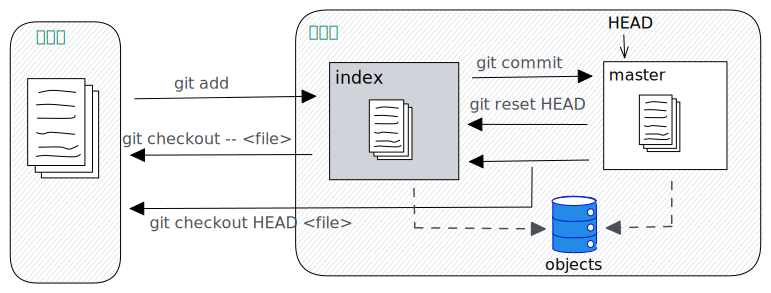

上图中，左侧为工作区，右侧为版本库

在版本库中标记为 index 的区域是暂存区。标记为 master 的是 master 所代表的目录树

HEAD 是一个游标，此时指向的是 master 分支。所以，在命令中可以用 HEAD 和 master 互相替换

objects 表示 git 对象库，实际位于当前工程中的`.git/objects`目录下

当在工作中区执行`git add`命令时，会将文件的修改更新到暂存区中，同时将文件内容更新到对象库中

当执行`git commit`命令时，暂存区的内容就会更新到版本库中。master 分支会做相应的更新

当执行`git reset HEAD`命令时，暂存区会被 master 分支所指向的内容替换掉。但是不会影响当前工作区

当`git rm --cached <file>`命令时，会直接从暂存区中删除文件，不会影响当前工作区

当执行`git checkout`或者`git checkout -- <file>`命令时，会用暂存区的全部或者指定文件替换当前工作区的文件。此命令比较危险，使用时一定要慎重

当执行`git checkout HEAD`或者`git checkout HEAD <file>`命令时，会用 HEAD 游标指向的全部或者指定文件替换当前工作区的文件。此命令也很危险，请慎重使用